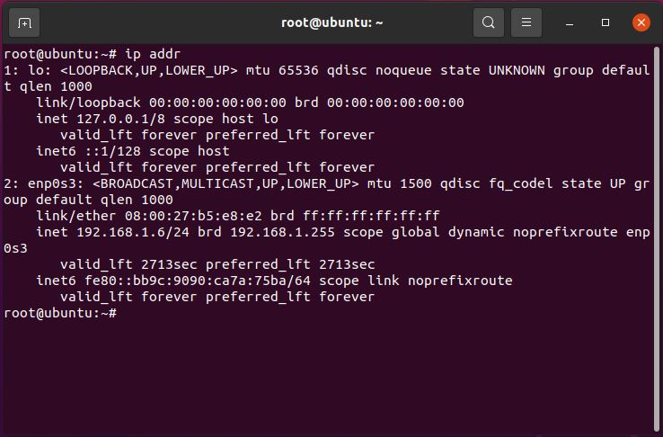
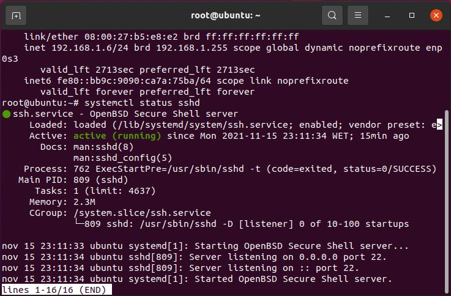
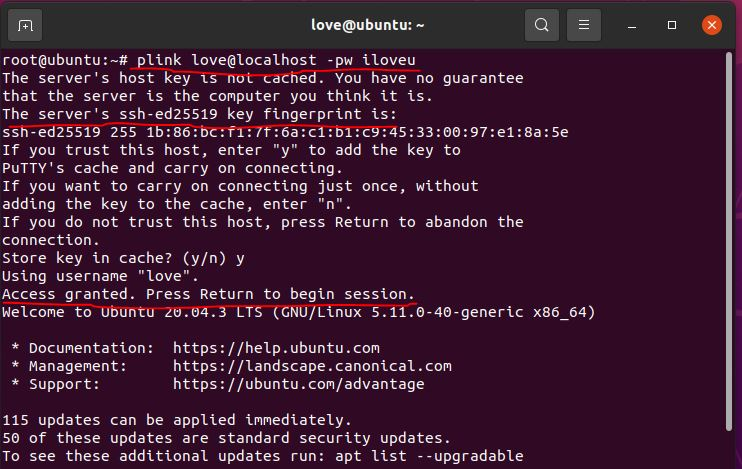
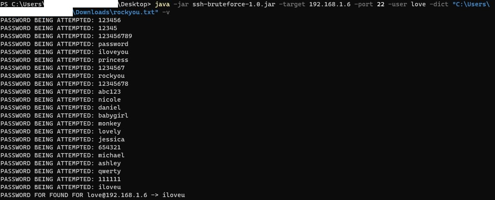

# ssh-bruteforce
An SSH Bruteforcer using Java, Apache Commons CLI and JCSH.

## Running

The project can be built using Gradle and has a task to make a fat jar.
To make it just use: ```./gradlew shadowjar```. It will be available in the build\libs folder.

The application accepts the following arguments:
- --ip $IP_ADDR
- --port $SSH_PORT
- --user $USER_NAME_TO_TRY
- --dict $FILE_PATH_OF_PASSWORDS_DICTIONARY
- -v [verbose option to print passwords being tested, no arg]

**All arguments are required except for the verbose flag.**

## Sample execution for example
Here's an example of this running against a Debian VM with an SSH server and a weak password.
First to confirm the IP address of the SSH server:



To confirm it's running SSH:



To prove the authentication details using PuTTY tools:



Using the application we can bruteforce with dictionary attack:



## TODO
To be done:
- [x] Multithreaded to run quicker (done, but has to be severely improved...)
- [ ] Variable timeout
- [ ] Dictionary attack on username
- [ ] Attack several ports for hidden SSH ports
- [ ] Log instead of printing to stdout
